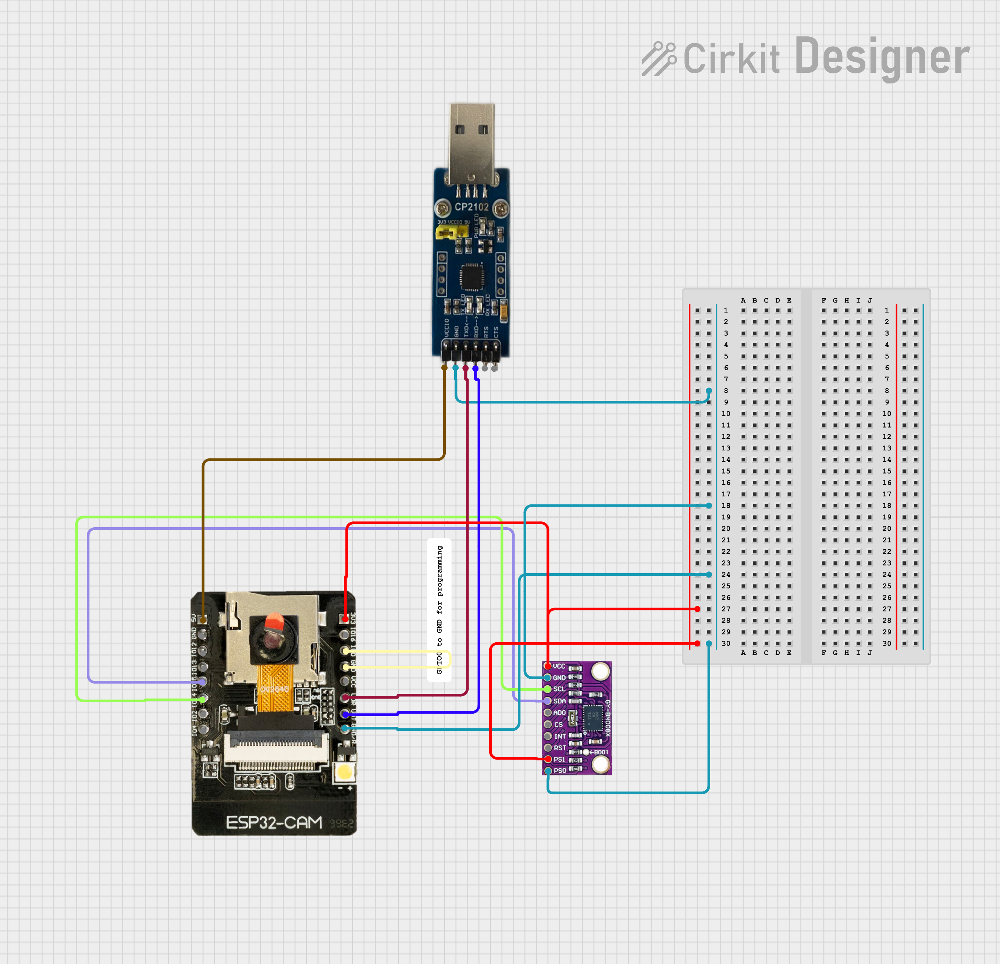
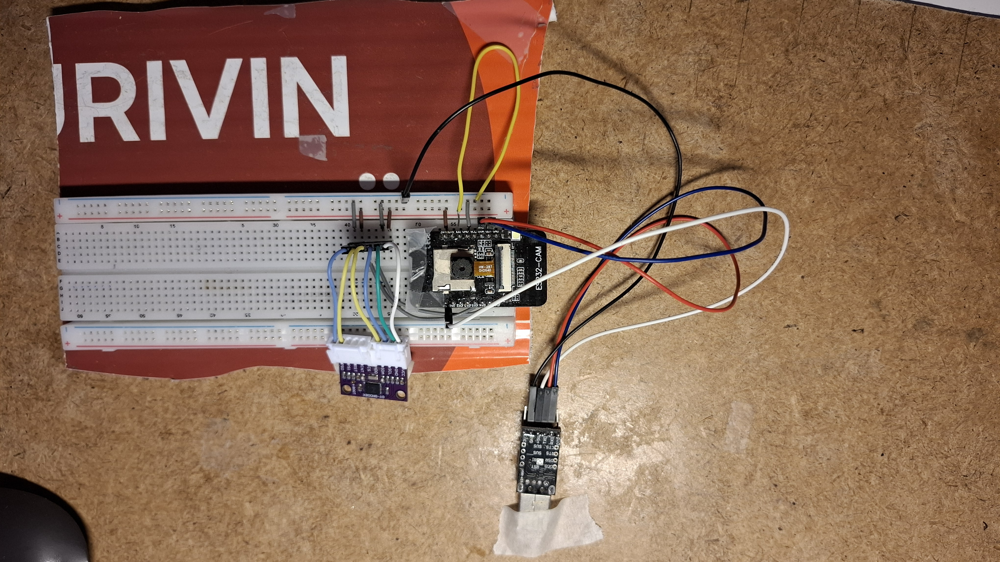

# bno08x-quaternion-arduino-esp32

Step-by-step PlatformIO/Arduino project to connect a **Bosch BNO085 (BNO08x)** IMU to an **ESP32-CAM** and read orientation / motion data over **UART**.  
This repository documents my incremental approach: validate each building block first (currently: **UART communication**) before moving to the final target hardware (**LilyGO T-Beam**).

---

## Status

✅ First successful test runs completed (ESP32-CAM ↔ BNO085 via UART).  
🚧 Work in progress: expanding sensor reports and moving toward quaternion/orientation use cases.

---

## Hardware

- **ESP32-CAM**
- **BNO085 / BNO08x IMU**
- **CP2102 USB-to-UART** adapter (for flashing + serial monitor)

---

## Development Environment

- **VS Code**
- **PlatformIO**
- Arduino framework (ESP32)

---

## Images

---

## Wiring / Circuit Documentation

This circuit integrates an ESP32-CAM module, a CP2102 USB-to-UART bridge, and a BNO085 IMU sensor. The ESP32-CAM serves as the main microcontroller, interfacing with the BNO085 sensor to read orientation data. The CP2102 module is used for serial communication with a host computer, facilitating programming and debugging of the ESP32-CAM.

### Component List

1. **CP2102 USB-to-UART Bridge**  
   - **Description**: A USB-to-UART bridge that allows for serial communication between a USB host and a UART device.  
   - **Pins**: VCC IO, GND, TXD, RXD, RTS, CTS  

2. **ESP32-CAM**  
   - **Description**: A microcontroller module with integrated Wi-Fi and Bluetooth, equipped with a camera interface.  
   - **Pins**: 5V, GND, OI12, OI13, IO15, IO14, IO2, IO1, 3V3, IO16, IO0, VCC, UOR, UOT, GND/R  

3. **BNO085 IMU Sensor**  
   - **Description**: An inertial measurement unit (IMU) sensor capable of providing orientation data.  
   - **Pins**: VCC, GND, SCL/SCK/RX, SDA/MISO/TX, ADR/MOSI, CS, INT, RST, PS1, PS0  

4. **Comment V2**  
   - **Description**: A placeholder component for comments or notes in the circuit design.  
   - **Pins**: None  

### Wiring Details

#### CP2102 USB-to-UART Bridge

- **VCC IO** → **ESP32-CAM 5V**  
- **GND** → **ESP32-CAM GND/R** and **BNO085 GND**  
- **TXD** → **ESP32-CAM UOR**  
- **RXD** → **ESP32-CAM UOT**

#### ESP32-CAM

- **5V** → **CP2102 VCC IO**  
- **GND/R** → **CP2102 GND** and **BNO085 GND**  
- **IO15** → **BNO085 SDA/MISO/TX**  
- **IO14** → **BNO085 SCL/SCK/RX**  
- **3V3** → **BNO085 VCC**  
- **UOR** → **CP2102 TXD**  
- **UOT** → **CP2102 RXD**  
- **IO0** → **ESP32-CAM GND** (boot mode for flashing; see notes below)

#### BNO085 IMU Sensor

- **VCC** → **ESP32-CAM 3V3**  
- **GND** → **ESP32-CAM GND/R** and **CP2102 GND**  
- **SDA/MISO/TX** → **ESP32-CAM IO15**  
- **SCL/SCK/RX** → **ESP32-CAM IO14**  
- **PS0** → **ESP32-CAM GND/R**  
- **PS1** → **ESP32-CAM 3V3**

---

## Flashing ESP32-CAM with CP2102 (Important)

⚠️ **ESP32-CAM boot mode requirement (GPIO0):**
1. **Before programming:** connect **GPIO0 → GND**
2. Start upload from PlatformIO
3. **After programming:** disconnect **GPIO0 from GND** (otherwise it will stay in bootloader mode)

⚠️ **Reset button usage:**
- Press **RESET** **before programming** (right before/when upload starts if needed)
- Press **RESET** **before opening / using Serial Monitor** (to ensure clean boot and output)

## Serial monitor example print

Accelerometer - x: 2.30 y: 2.22 z: 9.16

Accelerometer - x: 2.30 y: 2.18 z: 9.16

---

## License

This project is open-source under the MIT License. See [LICENSE](LICENSE) for more information.

---

## Acknowledgements

* Bosch / Hillcrest Labs – BNO085

chrom
