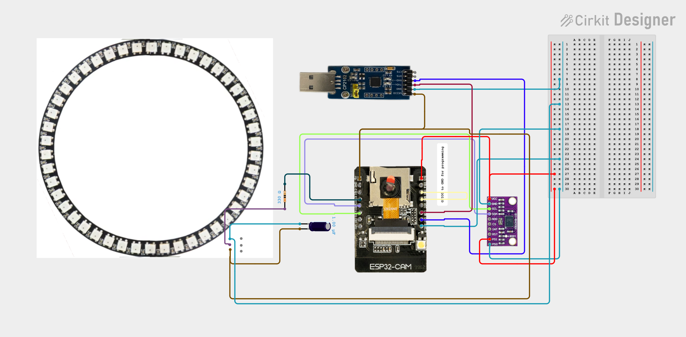
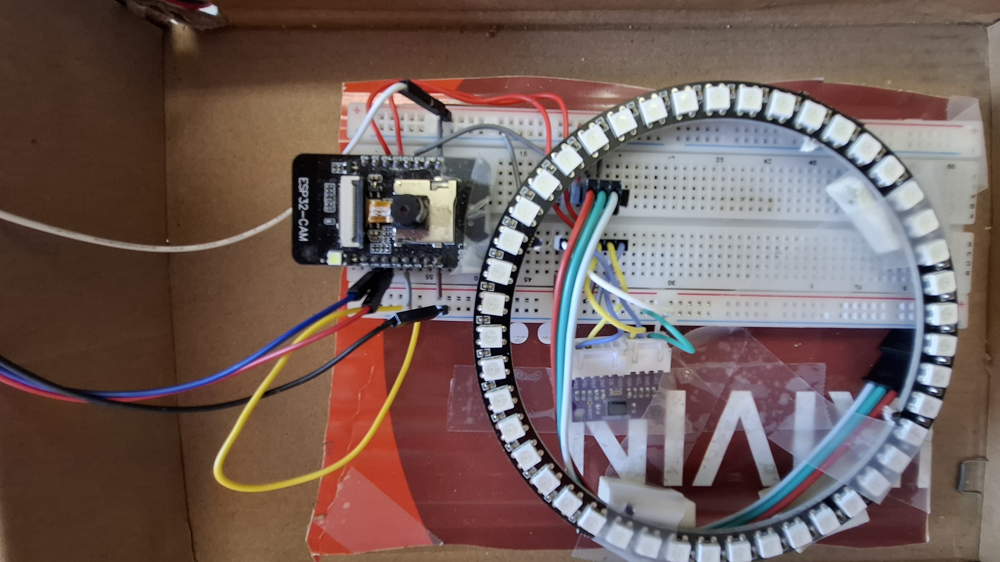
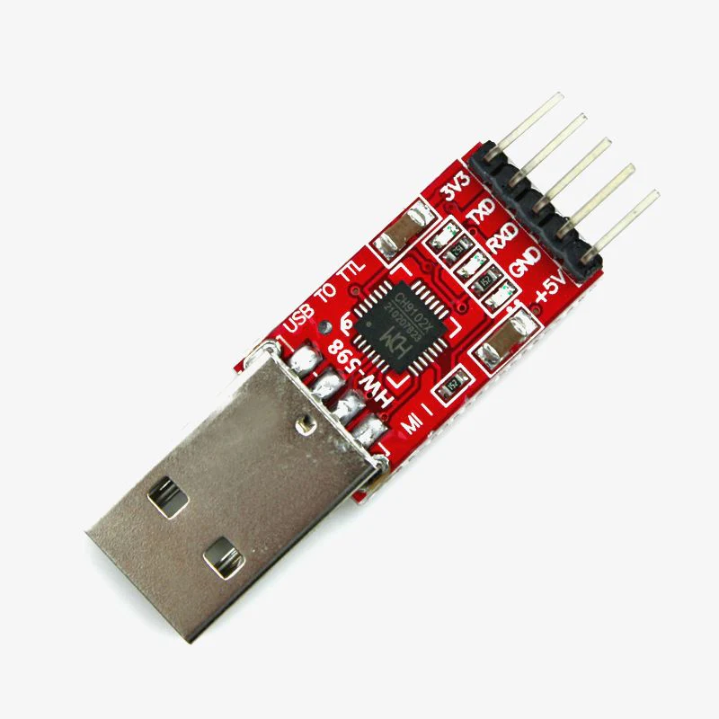
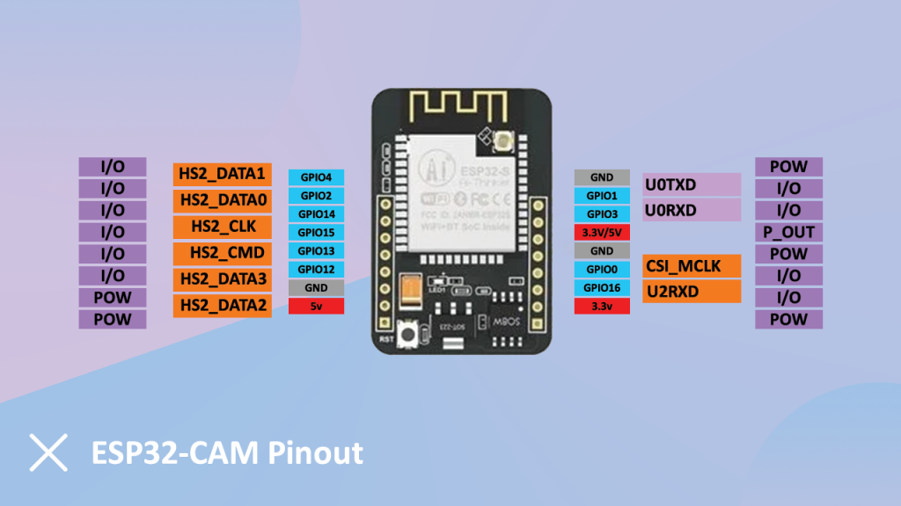
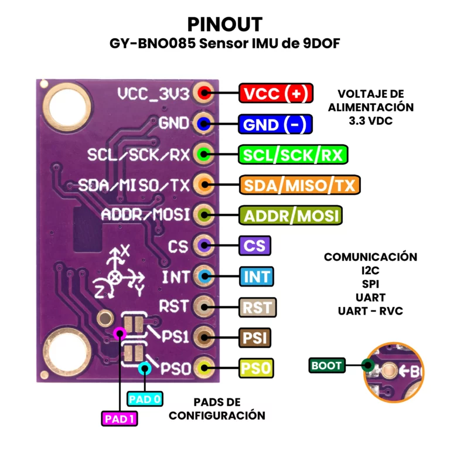
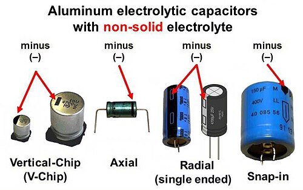

# bno08x-quaternion-arduino-esp32

Step-by-step PlatformIO/Arduino project to connect a **Bosch BNO085 (BNO08x)** IMU to an **ESP32-CAM** and read orientation / motion data over **UART**.  
This repository documents my incremental approach: validate each building block first (currently:  LED ring added to visualize the north direction). The used environment is VS Code and Platform IO.

---

## Status

✅ Successful test run with LED ring completed 
🚧 Work in progress: move the LED handling from main to seperate implementation file before moving it to the BeaconBuddyFinder project.

---

## Hardware

- **ESP32-CAM**
- **BNO085 / BNO08x IMU**
- **CP2102 USB-to-UART** adapter (for flashing + serial monitor)
- **Neopixel ring** 
- **capacitor(option)** 
- **Resistor(option)** 

---

## Development Environment

- **VS Code**
- **PlatformIO**
- Arduino framework (ESP32)

---

## Images

---
## Images

---
## CAD circuit

[Cirkit Designer project](https://app.cirkitdesigner.com/project/1237ee93-e452-48ec-8def-f4f1ca6864a7)

---

## Shopping cart

[Shopping cart](https://linktr.ee/UARTBNO085)

## Wiring / Circuit Documentation

This circuit integrates an ESP32-CAM module, a CP2102 USB-to-UART bridge, and a BNO085 IMU sensor. The ESP32-CAM serves as the main microcontroller, interfacing with the BNO085 sensor to read orientation data. The CP2102 module is used for serial communication with a host computer, facilitating programming and debugging of the ESP32-CAM.

### Component List

1. **CP2102 USB-to-UART Bridge**  
   - **Description**: A USB-to-UART bridge that allows for serial communication between a USB host and a UART device.  
   - **Pins**: VCC IO, GND, TXD, RXD, RTS, CTS  

2. **ESP32-CAM**  
   - **Description**: A microcontroller module with integrated Wi-Fi and Bluetooth, equipped with a camera interface.  
   - **Pins**: 5V, GND, OI12, OI13, IO15, IO14, IO2, IO1, 3V3, IO16, IO0, VCC, UOR, UOT, GND/R  

3. **BNO085 IMU Sensor**  
   - **Description**: An inertial measurement unit (IMU) sensor capable of providing orientation data.  
   - **Pins**: VCC, GND, SCL/SCK/RX, SDA/MISO/TX, ADR/MOSI, CS, INT, RST, PS1, PS0  

4. **NEOPIXEL WS2812 45 LED RING**  
   * **Description**: A ring of 45 individually addressable RGB LEDs.  each LED in the ring has its own WS2812, which contains a small IC, which receives a serial data stream, extracts the 24bits for itself and forwards remaining bits to next LED. The address of an LED is it's order in the chain, bits are encoded by the high-time vs low-time of pulses as a single-wire, timing-based protocol (not UART). Data line: DOUT of LED n → DIN of LED n+1 
   * **Pins**: GND, D1, 5V, D0
   * 45LED 120mm 102mm 9mm
   * RGB Full Color Highlighting

5. **Electrolytic Capacitor (optional)**  
   * **Description**: Used for power stabilization.  
   * **Properties**: Capacitance: 1 µF  
   * **Pins**: \-, \+  (note:  stripe marking and for most through‑hole electrolytic capacitors, the shorter lead is the negative (−) lead.)

6. **Resistor (optional)**  
   * **Description**: Used to limit current to the NeoPixel LED ring.  
   * **Properties**: Resistance: 330 Ohms  
   * **Pins**: pin1, pin2

## **Wiring Details**

### **CP2102 USB-to-UART Bridge**

* **VCC IO**: Connected to the positive terminal of the Electrolytic Capacitor.  
* **GND**: Connected to the common ground shared with ESP32-CAM, BNO085, Electrolytic Capacitor, and NeoPixel LED ring.  
* **TXD**: Connected to UOR of the ESP32-CAM.  
* **RXD**: Connected to UOT of the ESP32-CAM.

### ---

**ESP32-CAM**

* **5V**: Connected to the positive terminal of the Electrolytic Capacitor and 5V of the NeoPixel LED ring.  
* **GND/R**: Connected to the common ground shared with CP2102, BNO085, Electrolytic Capacitor, and NeoPixel LED ring.  
* **IO15**: Connected to SDA/MISO/TX of the BNO085.  
* **IO14**: Connected to SCL/SCK/RX of the BNO085.  
* **UOR**: Connected to TXD of the CP2102.  
* **UOT**: Connected to RXD of the CP2102.  
* **OI13**: Connected to pin2 of the Resistor.  
* **IO0**: Only during uploading of the program, IO0 is connected to GND of the ESP32-CAM.

### ---

**BNO085**

* **VCC**: Connected to 3V3 of the ESP32-CAM.  
* **GND**: Connected to the common ground shared with CP2102, ESP32-CAM, Electrolytic Capacitor, and NeoPixel LED ring.  
* **SDA/MISO/TX**: Connected to IO15 of the ESP32-CAM.  
* **SCL/SCK/RX**: Connected to IO14 of the ESP32-CAM.  
* **PS0**: Connected to the common ground.  
* **PS1**: Connected to 3V3 of the ESP32-CAM.

### ---

**NEOPIXEL WS2812 45 LED RING**

* **5V**: Connected to the positive terminal of the Electrolytic Capacitor and 5V of the ESP32-CAM.  
* **GND**: Connected to the common ground shared with CP2102, ESP32-CAM, BNO085, and Electrolytic Capacitor.  
* **D1**: Connected to pin1 of the Resistor.

### ---

**Electrolytic Capacitor**

* **\+**: Connected to VCC IO of the CP2102, 5V of the ESP32-CAM, and 5V of the NeoPixel LED ring.  
* **\-**: Connected to the common ground shared with CP2102, ESP32-CAM, BNO085, and NeoPixel LED ring.

### ---

**Resistor**

* **pin1**: Connected to D1 of the NeoPixel LED ring.  
* **pin2**: Connected to OI13 of the ESP32-CAM.

---

## Flashing ESP32-CAM with CP2102 (Important)

⚠️ **ESP32-CAM boot mode requirement (GPIO0):**
1. **Before programming:** connect **GPIO0 → GND**
2. Start upload from PlatformIO
3. **After programming:** disconnect **GPIO0 from GND** (otherwise it will stay in bootloader mode)

⚠️ **Reset button usage:** (note that the reset button is invisible "under" the chip, use a paperclip or any similar thin stick to push the button)
- Press **RESET** **before programming** (right before/when upload starts if needed)
- Press **RESET** **before opening / using Serial Monitor** (to ensure clean boot and output)

## Serial monitor example print

Adafruit BNO08x Accelerometer test!
BNO08x Found!
Reading events
sensor was reset Yaw: 0.00
Yaw: -141.18
Yaw: -141.19
Yaw: -141.14
Yaw: -139.31
Yaw: -139.32
Yaw: -139.31
Yaw: -139.30
Yaw: -139.29

---

## License

This project is open-source under the MIT License. See [LICENSE](LICENSE) for more information.

---

## Acknowledgements

* Bosch / Hillcrest Labs – BNO085
* Wolles Elektronikkiste
[Wolles Elektronikkiste](https://wolles-elektronikkiste.de/en/bno08x-9-dof-imus)

